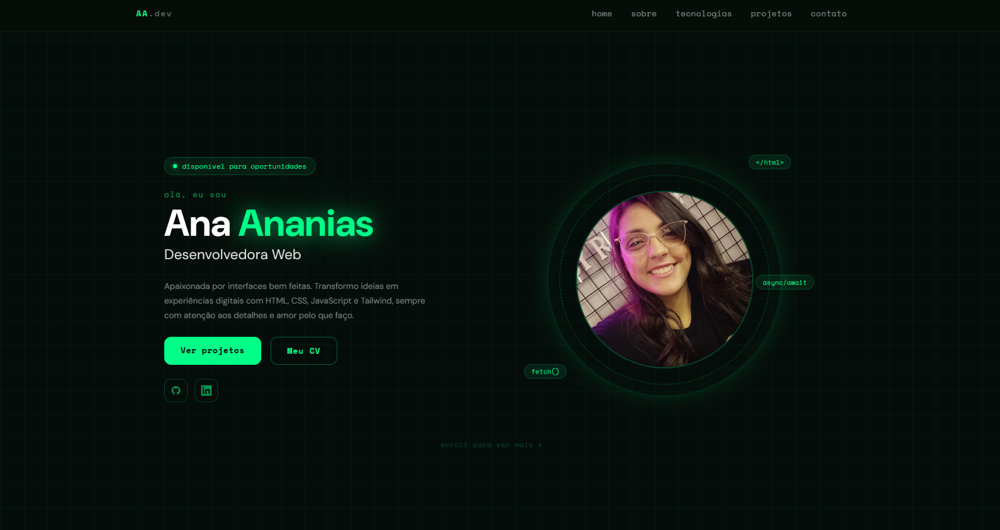
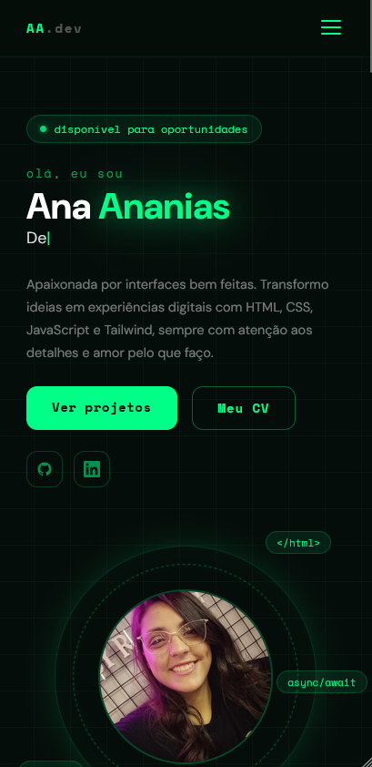

# Ana Ananias — Portfólio 💻


> Portfólio pessoal desenvolvido do zero com HTML, CSS, JavaScript e Tailwind. Temática hacker/terminal com animações, efeitos glitch e design responsivo.

### ✨ [Veja o portfólio ao vivo aqui!](https://anaflgg.github.io/ana-ananias-portfolio/)

---

### 📸 Screenshots

#### 💻 Desktop


#### 📱 Mobile


---

### 📖 Sobre o Projeto

Portfólio pessoal construído para apresentar minha trajetória, habilidades e projetos como desenvolvedora web. O design segue uma temática hacker com fundo escuro, cores neon e efeitos interativos que tornam a navegação mais imersiva.

O projeto foi desenvolvido inteiramente com tecnologias front-end puras, sem frameworks JS, priorizando semântica, acessibilidade e performance.

---

### 🚀 Tecnologias Utilizadas

- HTML5 semântico
- CSS3 (modularizado por seção)
- JavaScript puro (ES6+)
- Tailwind CSS (via CDN)
- Devicon (ícones de tecnologias)

---

### 🎮 Seções e Funcionalidades

- **Hero** — apresentação com efeito typewriter animado e foto de perfil
- **Sobre** — texto com efeito hacker text em loop e cards de trabalho
- **Tecnologias** — grade de skills com efeito glitch no hover
- **Projetos** — grid de cards com modal detalhado ao clicar
- **Contato** — animação de terminal hacker antes de revelar a seção

---

### 🧠 Aprendizados

- Modularização de CSS separando um arquivo por seção
- Criação de efeitos visuais com CSS puro: glitch, neon glow, scan lines
- Uso do Intersection Observer API para animações ao scroll e no terminal
- Manipulação do DOM para o sistema de modais dos projetos
- Efeito typewriter com lógica de digitação e apagamento em JavaScript
- Efeito glitch com geração de caracteres aleatórios via setInterval
- Animação de terminal hacker com sequência de linhas e fade de transição
- Uso do Clipboard para copiar email com feedback visual
- Organização de projeto com Jira (kanban pessoal)

---

### 🐛 Desafios e Soluções

- **Conflito do Tailwind com classe `ring`** — a classe `ring` é nativa do Tailwind e sobrescrevia meu CSS customizado sem eu perceber. Resolvido renomeando a classe no HTML para `ring-circle`.
- **Grid desalinhado na última linha** — nas seções de projetos e tecnologias, o último item ficava isolado à esquerda. Resolvido trocando `display: grid` por `display: flex` com `flex-wrap: wrap` e `justify-content: center`.
- **Hacker text quebrando no mobile** — o texto animado da seção "Sobre" tinha um número fixo de caracteres, causando overflow em telas pequenas. Resolvido calculando o tamanho dinamicamente com `Math.floor(el.offsetWidth / 10)`, fazendo o texto se adaptar à largura real do elemento em qualquer tela.
- **Imagens não carregavam no GitHub Pages** — caminhos iniciando com `../` não funcionam no Pages. Resolvido trocando para `./` em todos os caminhos de imagem.

---

### 🎨 Identidade Visual

A identidade visual hacker não foi uma escolha aleatória, eu queria um portfólio com personalidade real, que representasse quem eu sou. O tema escuro com neon e os efeitos de terminal são uma forma de mostrar que me importo com os detalhes e que gosto de criar experiências, não só páginas.

Foi incrivelmente divertido criar cada efeito, o ring na minha foto, o typewriter no hero, o glitchs nas tecnologias e projetos, o terminal animado no contato. Cada detalhe foi pensado pra combinar com a temática e tornar a navegação mais imersiva.

---

### 👷 Como executar o projeto

1. Clone o repositório:
```bash
git clone https://github.com/anaflgg/ana-ananias-portfolio.git
```

> Não requer instalação de dependências — todas as bibliotecas são carregadas via CDN.

---

© 2026 Ana Ananias. Todos os direitos reservados.
